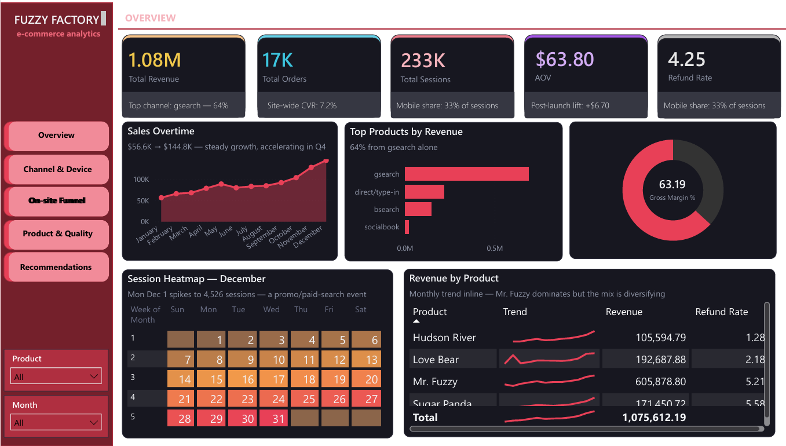
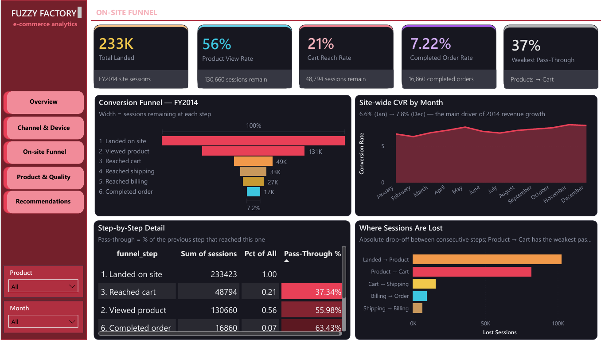
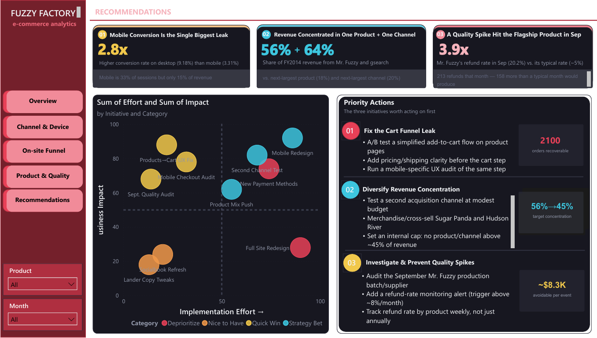

# Fuzzy Factory E-commerce Analytics

An end-to-end FY2014 e-commerce analytics project built with **SQL, DAX, and Power BI**.  
The project examines revenue growth, channel and device performance, the on-site conversion funnel, product quality, and business priorities.

## Project Objectives

- Track core commercial KPIs and monthly performance.
- Compare acquisition channels and device efficiency.
- Identify the largest leaks in the conversion funnel.
- Evaluate product revenue concentration and refund anomalies.
- Translate findings into prioritized business actions.

## Dashboard Pages

### 1. Overview
Executive summary of revenue, orders, sessions, AOV, refund rate, monthly sales trend, channel contribution, product performance, gross margin, and session activity.

### 2. Channel & Device
Compares conversion rate, revenue per session, order volume, and performance differences across acquisition channels and devices.

### 3. On-site Funnel
Tracks users from landing to completed order, shows pass-through rates, and highlights where the largest absolute and relative drop-offs occur.

### 4. Product & Quality
Analyzes product revenue mix, monthly refund rate, the September product-quality anomaly, and before-versus-after launch performance.

### 5. Recommendations
Summarizes the most important findings, prioritizes initiatives through an impact-versus-effort matrix, and presents practical business actions.

## Selected Insights

- Desktop conversion is approximately **2.8×** mobile conversion.
- Revenue is highly concentrated in **one flagship product** and **one acquisition channel**.
- The **Product → Cart** transition is the weakest funnel step.
- The flagship product's refund rate rose to approximately **20.2% in September**, versus roughly **5.2% across FY2014**.
- Average order value increased after the Hudson River Mini Bear launch, while site-wide conversion remained broadly stable.

## Tools & Skills

- **Power BI Desktop:** data modeling, DAX measures, dashboard design, conditional formatting, navigation, and interactive visuals
- **SQL:** data extraction, aggregation, KPI calculation, funnel analysis, channel/device analysis, and product-quality analysis
- **Data Visualization:** KPI cards, area charts, scatter plots, funnel charts, heatmaps, tables with sparklines, treemaps, and recommendation matrices
- **Business Analysis:** performance diagnosis, anomaly investigation, prioritization, and action-oriented recommendations

## Repository Structure

```text
fuzzy-factory-ecommerce-analytics/
├── README.md
├── .gitignore
├── assets/
│   ├── overview.png
│   ├── Channel and device dashboard.png
│   ├── on-site-funnel.png
│   ├── product and quality dashboard.png
│   └── recommendations.png
├── data/
│   └── README.md
├── docs/
│   └── project-notes.md
├── powerbi/
│   ├── README.md
│   └── fuzzy_factory_ecommerce_analytics.pbix
└── sql/
    ├── README.md
    └── analysis.sql
```

## Dashboard Preview

### Overview


### Channel & Device


### On-site Funnel


### Product & Quality


### Recommendations


## How to Use

1. Download or clone this repository.
2. Open the `.pbix` file in **Power BI Desktop**.
3. Review the SQL scripts in the `sql/` folder.
4. Refresh data sources only after updating the local file paths in Power BI.
5. Use the navigation buttons to move between dashboard pages.

## Notes

- The analysis period is **FY2014**.
- Some dashboard tables are purpose-built SQL summary tables at different levels of aggregation.
- Scenario impacts shown on the Recommendations page are directional estimates rather than guaranteed forecasts.
- Raw or sensitive data should not be uploaded publicly.

## Author

**Nguyễn Lê Khánh An**  
Final-year Applied Economics student at the University of Economics Ho Chi Minh City (UEH)

---

This repository is intended for portfolio and learning purposes.
